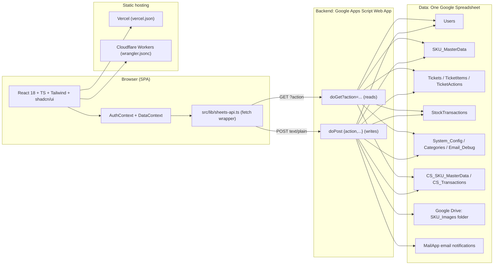

# StockFlow Manager — Complete Application Blueprint (APP MASTER SPEC)

> **Purpose of this one file:** hand this document to any AI coding agent and it can rebuild the entire
> **StockFlow Manager** web app, backend, data layer, and deployment 100% working and looking the same as the
> original. It contains everything: what the app is, the engine, the backend API contract, the frontend
> pages/roles/routes, the complete data schema, every business rule, report formulas, mock data, and
> deployment config (current hosts **Vercel / Cloudflare Workers**, next target **Cloudflare + Supabase**).

---

## 1. What Is This App?

| Item | Value |
|---|---|
| **Product name** | StockFlow Manager — "Easy Gold MIMS 2026" |
| **In-app title (toolbar)** | Easy Gold Merge Management |
| **Footer / brand line** | Easy Gold By Khamphouvong |
| **Industry** | Gold jewellery manufacturing (internal stock control) |
| **Currency symbol** | `₭` (Lao Kip) — see `CURRENCY = '₭'` in `src/lib/types.ts` |
| **Language** | English (single locale) |
| **Users it serves** | Staff, Warehouse Manager, Line Manager, Director, Admin, Finance, Customer Service (CS) |
| **Logical model** | Two warehouses: **MKT** (main/merch stock) and **CS** (Customer Service warehouse). One web app + one data source. |
| **Primary workflow** | Staff request/borrow stock → Warehouse reviews & books stock → Line Manager approves → Director finalizes → (for borrows) warehouse processes the return. |

### 1.1 Feature summary
- Role-based login (email + password, plaintext check against the Users sheet) with `localStorage` session.
- Create **Request** tickets (consumables, permanent use) and **Borrow** tickets (must come back, with return date).
- **Action Center**: per-role approval queue (pending → reviewed → lm_approved → finalized) plus reject, recall,
  return processing (with broken/lost quantity) and auto low-cost bypass.
- **Auto email notifications** at each status transition.
- SKU master management (add/edit/delete/restock), image upload to Google Drive, categories, low-stock thresholds,
  cost per unit, total inflow.
- Reports: **Dashboard**, **Inventory Report** (date-range usage/loss), **Month End Report** (opening/stock
  in/out/closing with XLSX export and print), **Total Stock** (MKT+CS merged).
- **Second (CS) warehouse**: own SKU master + transactions, CS direct destock, auto-restock when a `cs_transfer`
  ticket is finalized, CS→MKT transfer.
- Export/print support and a print-only landscape CSS injection for wide tables.

---

## 2. Engine & Tech Stack

### 2.1 Frontend engine (SPA)
- **React 18.3.1** + **TypeScript 5.8** (strict), built with **Vite 5.4.19**.
- **Routing**: `react-router-dom` v6 (`BrowserRouter`, `<Routes>`, guard components).
- **UI**: Tailwind CSS 3.4 + `shadcn/ui` components (Radix primitives), `lucide-react` icons,
  `sonner` + `@radix-ui/react-toast` toasts, `react-hook-form` + `zod` forms.
- **Charts**: Recharts. **Excel export**: `xlsx` (SheetJS). **Dates**: `date-fns`.
- **Data fetching**: `@tanstack/react-query` (QueryClientProvider wrapper) + a custom React Context layer
  (`DataContext`) that hydrates all data and exposes CRUD wrappers.
- **CSS theme**: HSL variables defined in `:root` (see §6.6 for exact values); Google Sans/Roboto fonts;
  gold-gradient branding: `linear-gradient(135deg, hsl(40 90% 50%), hsl(35 85% 55%))`.

### 2.2 Backend engine (today: Google Apps Script)
- A single **Google Apps Script** web app (`google-apps-script/Code.gs`, 2458 lines) deployed as:
  **Deploy → New deployment → Web app**, *Execute as = Me*, *Who has access = Anyone*.
- It acts as a **JSON REST-ish API** over one Google Spreadsheet
  (`SPREADSHEET_ID = '1G7Gddq-OVt3e7tBXuQs6sM5Z8qF3mTFMAY65lMG-JqI'`).
- `doGet(e)` → read/list endpoints via `?action=...`. `doPost(e)` → mutation endpoints via JSON body
  `{ action, ...data }`. All responses are `ContentService.createTextOutput(JSON.stringify(result))`, JSON mime.
- Uses `DriveApp` for SKU image uploads and `MailApp` for status emails. No npm packages on the backend.
### 2.3 Frontend↔Backend protocol (critical detail)
- **GET reads** (`src/lib/sheets-api.ts` → `fetchApi`): plain `GET` to the web-app URL with `?action=` plus params.
- **POST writes** (`postApi`): `fetch(url, { method:'POST', headers:{ 'Content-Type':'text/plain;charset=utf-8' }, body: JSON.stringify({...data, action}) })`.
  - **Why `text/plain`?** Apps Script web apps can't answer CORS *preflight*, so the body must be a "simple request",
    and `redirect: 'follow'` must be set because Apps Script redirects to `script.googleusercontent.com`.
  - Errors are returned as `{ error: string }` — every wrapper does `if (json.error) throw new Error(json.error)`.

### 2.4 Hosting engine (today)
- **Vercel** (`vercel.json`): SPA rewrite `/(.*) → /index.html`; immutable cache headers for `/assets/*`.
- **Cloudflare Workers + Pages-assets** (`wrangler.jsonc`): worker name `easy-god-merch`,
  `assets.directory = "./dist"`, `not_found_handling = "single-page-application"`.
- Build output → `dist/` via Vite; dev server runs on **port 8080**, host `::`, HMR overlay disabled.

### 2.5 Full npm dependency list (root `package.json`)
```json
"dependencies": {
  "@hookform/resolvers": "^3.10.0",
  "@radix-ui/react-accordion", "@radix-ui/react-alert-dialog", "@radix-ui/react-aspect-ratio",
  "@radix-ui/react-avatar", "@radix-ui/react-checkbox", "@radix-ui/react-collapsible",
  "@radix-ui/react-context-menu", "@radix-ui/react-dialog", "@radix-ui/react-dropdown-menu",
  "@radix-ui/react-hover-card", "@radix-ui/react-label", "@radix-ui/react-menubar",
  "@radix-ui/react-navigation-menu", "@radix-ui/react-popover", "@radix-ui/react-progress",
  "@radix-ui/react-radio-group", "@radix-ui/react-scroll-area", "@radix-ui/react-select",
  "@radix-ui/react-separator", "@radix-ui/react-sheet", "@radix-ui/react-sidebar", "@radix-ui/react-slot",
  "@radix-ui/react-slider", "@radix-ui/react-switch", "@radix-ui/react-tabs", "@radix-ui/react-toast",
  "@radix-ui/react-toggle", "@radix-ui/react-toggle-group", "@radix-ui/react-tooltip",
  "@tanstack/react-query": "^5.83.0", "@vercel/speed-insights": "^2.0.0",
  "class-variance-authority": "^0.7.1", "clsx": "^2.1.1", "cmdk": "^1.1.1", "date-fns": "^3.6.0",
  "embla-carousel-react": "^8.6.0", "input-otp": "^1.4.2", "lucide-react": "^0.462.0",
  "next-themes": "^0.3.0", "react": "^18.3.1", "react-day-picker": "^8.10.1",
  "react-dom": "^18.3.1", "react-hook-form": "^7.61.1", "react-resizable-panels": "^2.1.9",
  "react-router-dom": "^6.30.1", "recharts": "^2.15.4", "sonner": "^1.7.4",
  "tailwind-merge": "^2.6.0", "tailwindcss-animate": "^1.0.7", "vaul": "^0.9.9",
  "xlsx": "^0.18.5", "zod": "^3.25.76"
},
"devDependencies": {
  "@eslint/js": "^9.32.0", "@tailwindcss/typography": "^0.5.16",
  "@testing-library/jest-dom": "^6.6.0", "@testing-library/react": "^16.0.0",
  "@types/node": "^22.16.5", "@types/react": "^18.3.23", "@types/react-dom": "^18.3.7",
  "@vitejs/plugin-react-swc": "^3.11.0", "autoprefixer": "^10.4.21", "eslint": "^9.32.0",
  "eslint-plugin-react-hooks": "^5.2.0", "eslint-plugin-react-refresh": "^0.4.20",
  "globals": "^15.15.0", "jsdom": "^29.1.1", "lovable-tagger": "^1.1.13",
  "postcss": "^8.5.6", "tailwindcss": "^3.4.17", "typescript": "^5.8.3",
  "typescript-eslint": "^8.38.0", "vite": "^5.4.19", "vitest": "^3.2.4", "wrangler": "4.110.0"
}
```

### 2.6 Tooling config highlights
- **`vite.config.ts`**: `@` alias → `./src`; manual chunks `vendor-react` (react/react-dom/react-router-dom),
  `vendor-xlsx` (xlsx), `vendor-ui` (radix dialog/popover/select); chunkSizeWarningLimit 1000.
- **`tailwind.config.ts`**: shadcn dark-mode class strategy; content globs for `./index.html`, `./src/**/*.{ts,tsx}`.
- **`tsconfig`**: standard Vite React app split (`tsconfig.app.json`, `tsconfig.node.json`).
- **`components.json`**: shadcn config pointing at `src/components/ui`, class util `@/lib/utils`.
- Env file `.env` / `.env.example` contains exactly one variable:
  `VITE_SHEETS_API_URL=https://script.google.com/macros/s/.../exec` (comment block explains Apps Script setup).
- Scripts: `dev` (vite), `build` (vite build), `build:dev`, `lint` (eslint .), `preview` (vite preview),
  `test` (vitest run), `test:watch` (vitest).
- Root `index.html`: `<div id="root">`, module script `/src/main.tsx`, preconnect/dns-prefetch to `script.google.com`,
  title "Easy Gold Merch".
---

## 3. System Architecture



**High-level data flow**
1. User opens `/login` → `AuthContext.login()` → `postApi('login', {email, password})`.
2. On success, app stores the returned user profile (id, name, email, role, department) in
   `localStorage['sf_user']` and redirects to `/dashboard`.
3. `<DataProvider>` (`DataContext`) calls `fetchAllData(role, includeCs)` which hits `?action=allData`
   (+ `role`, `includeCs=true`) and hydrates: users, skus, tickets, transactions, categories, config, remarks,
   and (for admin/director/CS) csSkus + csTransactions.
4. Every mutation (createTicket, updateTicket, updateSku, restockSku, cs_destockSku, …) is a `postApi` write;
   `refresh()` re-fetches `allData` when the toolbar **Refresh** button is clicked.
5. Apps Script applies stock accounting rules, writes rows to the sheets, may send email, and returns JSON.

---

## 4. Data Layer — Complete Google Spreadsheet Schema

> Sheet tabs are **auto-created** by the backend (`getOrCreateSheet` + `ensureColumns`) on first use. The header
> map lookups are **flexible**: column names are matched case-insensitively and by synonym
> (`sku_id` vs `id`, `opening_balance` vs `opening`, `current_stock` vs `current`, `total_inflow` vs `inflow`,
> `image`/`image_url`/`photo`/`img`, `createdat`/`created_at`, `qty_broken`/`broken`/`lost`).

### 4.1 `Users`
| Column | Purpose |
|---|---|
| User_ID | `u-NNN…` or email fallback; primary key |
| Username | username or email |
| Password | **plaintext** password (MVP only; must become Supabase Auth in migration) |
| Full_Name | display name |
| Email | login identifier, lowercased |
| Role | sheet labels: `Admin`, `Director`, `Warehouse`, `Line Manager`, `Staff`, `Finance`, `Customer Service` |
| Department | e.g. Production, Warehouse, Executive, IT |
| Status | `Active` (can log in) or `Inactive` (blocked) |

### 4.2 `SKU_MasterData` (MKT warehouse)
`SKU_ID, Name, Category, Unit, Opening_Balance, Current_Stock, Total_Inflow, Image, Low_Stock_Threshold, Cost_Per_Unit, createdAt`

### 4.3 `Tickets`
`Ticket_ID, Created_By, Created_By_Name, Department, Delivery_Date, Remark, Status, Created_At, WH_Comment, LM_Comment, Director_Comment, Last_Action_At, Last_Action_By, Last_Action_Status, Last_Action_Comment, Actual_Delivery_Date, Type, Return_Date`

### 4.4 `TicketItems`
`Ticket_ID, SKU_ID, SKU_Name, Qty_Requested, Qty_Approved, Unit`

### 4.5 `StockTransactions`
`ID, Ticket_ID, SKU_ID, SKU_Name, Qty, Qty_Broken, Type, Date, Action_At, Action_By, Status, Comment`
- `Type`: `addition` (stock in) or `deduction` (stock out).
- `Ticket_ID` sentinels: `OPENING` (opening balance recorded as a transaction when a SKU is added), `RESTOCK` (manual restock), `DIRECT_DESTOCK` (CS direct destock).

### 4.6 `TicketActions` (audit trail)
`Action_ID, Ticket_ID, Action, Status, Action_At, Action_By, Comment, Role`

### 4.7 `System_Config` (Key / Value / Description)
Known keys: `bypass_threshold` (cost below which approval levels are skipped) and `bypass_level`
(`none` | `wh_only` | `wh_lm`). Written via `?action=config`.

### 4.8 `Categories` (Name)
Drives the category dropdowns. Managed from System Settings.

### 4.9 `CS_SKU_MasterData` (Customer Service warehouse)
`SKU_ID, Name, Category, Unit, Opening_Balance, Current_Stock, Total_Inflow, Low_Stock_Threshold, Cost_Per_Unit, Image, CreatedAt`
- Auto-created on first `cs_skus` call; SKUs auto-created from MKT master on finalized `cs_transfer` tickets
  (copies name/category/unit/threshold/cost/image; first arrival becomes Opening Balance).

### 4.10 `CS_Transactions`
`ID, Ticket_ID, SKU_ID, SKU_Name, Qty, Type, Date, Action_At, Action_By, Comment`
- `Ticket_ID` sentinels: `OPENING` (SKU genesis arrival tagged to not count as stock-in), `RESTOCK`, `DIRECT_DESTOCK`,
  or a real MKT `TKT-xxxxx` when transferred in; comment always starts `Auto-transferred from MKT WH - Ticket: …`.

### 4.11 `Email_Debug` (helper log)
Backend writes email send status here via `logEmailDebug(ss, msg)` for troubleshooting.
---

## 5. Backend API Contract (`Code.gs`)

### 5.1 GET / read endpoints (`?action=…`, plain query param)
| action | params | returns |
|---|---|---|
| `users` | — | `{ users: [{id,name,email,role,department}] }` |
| `skus` | `role` (optional, reserved) | `{ skus: SKU[] }` (full list for every role) |
| `tickets` | — | `{ tickets: Ticket[] }` with nested `items[]` |
| `transactions` | — | `{ transactions: StockTransaction[] }` enriched with skuName/skuCostPerUnit |
| `debug` | — | `{ SheetName: {headers, map} }` (header debugging) |
| `getCategories` | — | `string[]` |
| `config` | — | `{ key: value, … }` System_Config map |
| `remarks` | — | `any[]` remark log rows |
| `cs_skus` | — | `{ skus: SKU[] }` CS warehouse SKUs |
| `cs_transactions` | — | `{ transactions: StockTransaction[] }` CS transactions |
| `allData` | `role`, `includeCs=true` | `{ users, skus, tickets, transactions, categories, config, remarks, csSkus?, csTransactions? }` — the **main bootstrap call** |

### 5.2 POST / write endpoints (JSON body `{ action, … }`)
| action | body fields | effect |
|---|---|---|
| `login` | email, password | returns `{ success, user }` or `{ error }` |
| `createTicket` | ticket fields + items[] | appends Tickets row, TicketItems rows, sends email to warehouse (`pending`) |
| `updateTicket` | ticketId, status, ticketType?, updates?, actionMeta? | state machine (§5.4) |
| `updateSku` | id, updates{} | partial update of SKU master cell values |
| `addSku` | sku{} | appends SKU row **and records opening balance as `OPENING` addition transaction** |
| `deleteSku` | id | deletes SKU master row |
| `restockSku` | id, qty, remark, date? | adds to `Current_Stock` + `Total_Inflow`, logs `addition` tx `RESTOCK` |
| `uploadImage` | base64, fileName | saves to `SKU_Images` Drive folder → returns `{ success, url }` (`https://drive.google.com/uc?id=…`) |
| `repairSkus` | — | recomputes Total_Inflow = Opening + Σ additions; migrates image column |
| `addCategory` / `deleteCategory` | name | manage Categories tab |
| `addUser` | user{} | header-mapped append to Users |
| `addUserManual` | userData | positional append (User_ID, Username, Password, Full_Name, Email, Role, Department, Active) |
| `updateUser` | id, updates{} | edits user cells |
| `deleteUser` | id | deletes a Users row |
| `updateConfig` | config{} | upserts System_Config key/value |
| `addRemark` | skuId, remark, userName, userRole, timestamp | appends remark log |
| `logSettingChange` | action, doneBy, userRole, details | appends settings audit log |
| `cs_addSku` | sku (id?, name, category, unit, openingBalance, currentStock, lowStockThreshold, costPerUnit, imageUrl?) | new CS SKU (+ OPENING CS tx when qty>0) |
| `cs_updateSku` | id, updates{} | edits CS SKU master |
| `cs_restockSku` | skuId, qty, actionBy, comment? | CS stock + inflow increase, `RESTOCK` CS tx |
| `cs_destockSku` | skuId, qty, actionBy, comment?, date? | CS stock decrease (floor 0), `DIRECT_DESTOCK` CS tx |
| `cs_deleteSku` | id | deletes CS SKU row |

**HTTP notes.** All POST responses JSON. Request body sent as `text/plain;charset=utf-8` to skip CORS preflight.
Reads go through `GET` with the action in the query string; Apps Script maps `e.parameter.action`.
### 5.3 Auth logic (`login`)
1. Read Users sheet; lowercase & trim email.
2. If `Status` is `inactive` → error `'Account is inactive'`.
3. Compare plaintext password string. Match → return
   `{ success:true, user:{ id, name, email, role, department } }` (role normalized via `getAppRole`).
4. Missing Password column → error `'System configuration error: Password column missing in Users sheet'`.
5. Wrong password → `'Invalid password'`; no matching email → `'User not found'`.

### 5.4 Ticket state machine (the heart of the backend — `updateTicket`)
Statuses: `pending → reviewed → lm_approved → finalized`; plus `rejected`, `returned`, `recalled`.

| Transition | Trigger | Backend side effects |
|---|---|---|
| create → `pending` | Staff submits | Tickets row + TicketItems rows appended; email → all `warehouse` users |
| `pending → reviewed` | Warehouse reviews | Writes WH_Comment; sets `Actual_Delivery_Date`; **books stock**: for each item appends a `deduction` tx (`Status='Booked'`) and decrements `Current_Stock` (floor 0) using `qtyApproved ?? qtyRequested`; email → `line_manager` |
| `reviewed → lm_approved` | Line Manager approves | Writes LM_Comment; email → `director` |
| `lm_approved → finalized` | Director finalizes | email → requester. **If `Type = cs_transfer`** → `autoRestockCsWarehouse(items, ticketId)` |
| `reviewed`/`lm_approved → rejected` | any approver rejects | **restock**: `addition` tx `Status='Rejected - Stock Returned'`, `Current_Stock += qty`; email → requester |
| `reviewed`/`lm_approved → recalled` | admin/WH recall | **restock**: `addition` tx `Status='Recalled - Stock Returned'`, `Current_Stock += qty`; email → requester |
| `finalized → returned` (borrow) | Warehouse “Return Completed” | For each returned item: `qtyReturned ?? qtyApproved ?? qtyRequested` added back (`addition` tx `Status='Returned'`), optional `qtyBroken` recorded in the tx; `Current_Stock += qtyRet`. Comment suffixes `(N broken/lost)`. email → requester |
| any → `returned`/`finalized` | — | sets Return_Date / type / actual dates as provided |

**Admin bypass (config driven).** If `bypass_threshold > 0` and `bypass_level != 'none'`, then when ticket total
(`Σ qtyApproved|qtyRequested × costPerUnit`) is **below the threshold**:
- `reviewed` + `bypass_level='wh_only'` → jump straight to `finalized`.
- `lm_approved` + (`wh_only` or `wh_lm`) → jump straight to `finalized`.

**Action audit trail.** Every `updateTicket` appends a `TicketActions` row and stamps the Tickets row with
`Last_Action_At / By / Status / Comment`.

### 5.5 CS auto-restock (`autoRestockCsWarehouse`)
Fire inside `updateTicket` when new status is `finalized` **and** ticket `Type` is `cs_transfer`:
- Look up items from TicketItems.
- For each item qty>0:
  - CS SKU exists → `Current_Stock += qty`, `Total_Inflow += qty`.
  - CS SKU missing → create from MKT master (copy name/category/unit/threshold/cost/image); the first quantity
    becomes `Opening_Balance`, `Current_Stock`, `Total_Inflow`.
  - Append `addition` transaction in `CS_Transactions`; `ticket_id` = `OPENING` for genesis SKUs else real ticket id;
    `action_by='MKT Warehouse'`; comment `Auto-transferred from MKT WH - Ticket: <id>`.

### 5.6 Email notifications (`sendEmailNotification`)
| ticket.status | recipients |
|---|---|
| `pending` | users with role `warehouse` |
| `reviewed` | users with role `line_manager` |
| `lm_approved` | users with role `director` |
| `finalized` / `rejected` / `returned` / `recalled` | the requester (matched by `createdBy` id or email) |

Email body is an HTML table (No., Item Name, Qty Req, Qty Appr, Status, Comment, Est. Delivery) with gold accent
header and an Approve button area; sent with `MailApp.sendEmail`.

### 5.7 SKU utilities
- `addSku` records opening balance as a real `OPENING` addition tx so month-end/inventory reports are accurate.
- `restockSku` increments `Current_Stock` **and** `Total_Inflow`, logs `RESTOCK` tx (with `date` and `comment`).
- `repairSkus` recomputes `Total_Inflow = Opening_Balance + Σ additions` per SKU and migrates `Image` column value
  into `Image_URL` column when only one exists.
- `uploadImage` stores decode(base64) blob into Drive folder `SKU_Images`, shares `ANYONE_WITH_LINK / VIEW`,
  returns `https://drive.google.com/uc?id=<fileId>`.
---

## 6. Frontend — Routes, Roles, Contexts & Pages

### 6.1 Route table (`src/App.tsx`)
| Path | Page | Access (role) |
|---|---|---|
| `/login` | LoginPage | everyone (redirects to `/dashboard` if already logged in) |
| `/dashboard` | DashboardPage | all roles |
| `/new-request` | NewRequestPage | staff, warehouse, line_manager, director, admin, customer_service |
| `/borrow` | BorrowPage | staff, warehouse, line_manager, director, admin, customer_service |
| `/cs-destock` | CsDestockPage | customer_service |
| `/cs-to-mkt-transfer` | TransferToMktPage | admin, warehouse |
| `/my-tickets` | MyTicketsPage | all roles |
| `/action-center` | ActionCenterPage | warehouse, line_manager, director, admin |
| `/history-tickets` | HistoryTicketsPage | warehouse, line_manager, director, admin, finance, customer_service |
| `/inventory-report` | InventoryReportPage | admin, warehouse, line_manager, director, finance, customer_service |
| `/total-stock` | TotalStockPage | admin, director |
| `/month-end-report` | MonthEndReportPage | finance, admin, director, warehouse, customer_service |
| `/settings` | SystemSettingsPage | admin, warehouse, customer_service |
| `/` | → redirect `/dashboard` | — |
| `*` | NotFound | — |

Routing guard: `ProtectedRoutes` renders `<DataProvider>` only when `user` exists; each route is conditionally
registered with `hasAccess([...])`. `App` wraps everything in
`QueryClientProvider → TooltipProvider → Toaster(radix) + Sonner → BrowserRouter → AuthProvider → AppRouter`.

### 6.2 Roles & permissions matrix
| Role | Can do |
|---|---|
| `staff` | request, borrow, view my tickets, dashboard |
| `warehouse` | review (book stock), set actual delivery dates, reject, recall, process borrow returns + broken qty, manage SKUs/categories, CS→MKT transfer, reports, settings |
| `line_manager` | approve after reviewed, comment, view dept tickets/inventory reports |
| `director` | final approval (finalize), view all, total stock, month-end |
| `admin` | everything incl. user management, system config, bypass, both warehouses toggle |
| `finance` | history, inventory report, month-end report |
| `customer_service` | request (auto `cs_transfer`), CS destock page, CS inventory/report/settings, own tickets, month-end (CS view) |

### 6.3 Sidebar menu (role-filtered `AppSidebar`)
`Dashboard, New Request, Item Borrow, Destock (cs), Return to MKT (admin/wh), My Tickets, Action Center,
History Ticket, Inventory Report, Month End Report, System Settings` (+ existing commented-out `Total Stock`).
Red ping dot + count badge on **Action Center** when `actionableTicketCount > 0`; dot on **My Tickets** when
`hasMyTicketUpdates`. Menu is hidden on print.

### 6.4 Contexts
- **`AuthContext`**: `user`, `loading`, `login(email,password)`, `logout()`, `hasAccess(roles)`.
  Session persisted in `localStorage['sf_user']`. Normalizes sheet role strings via a roleMap
  (unknown → `staff`). Logs normalized role with `console.log('[Auth] raw role …')`.
- **`DataContext`**: hydrates `tickets, skus, transactions, csSkus, csTransactions, users, categories, remarks`,
  `loading`, `error`, `refresh()`; exposes actions `createTicket`, `updateTicketStatus`, `addSku`, `updateSku`,
  `deleteSku`, `addUser`, `updateUser`, `deleteUser`, `addCategory`, `deleteCategory`, `restockSku`,
  `uploadSkuImage`, `updateSystemConfig`, `patchTicketFields`, `repairSkus`, `addRemark`, and CS actions
  `csAddSku, csUpdateSku, csDeleteSku, csRestockSku, csDestockSku, transferCsToMkt`.
  Computes `actionableTicketCount` per role (warehouse: pending + finalized-borrow-unreturned; line_manager:
  reviewed; director: lm_approved; admin: any non-terminal) and `hasMyTicketUpdates` comparing seen statuses
  (stored in `localStorage['seenTicketStatuses']`) vs ticket status. `transferCsToMkt` creates a
  `cs_transfer`-style ticket moving CS→MKT stock via a returned-items update.

### 6.5 Core types (`src/lib/types.ts`)
```ts
UserRole = 'staff' | 'warehouse' | 'line_manager' | 'director' | 'admin' | 'finance' | 'customer_service';
WarehouseScope = 'mkt' | 'cs';
TicketStatus = 'pending' | 'reviewed' | 'lm_approved' | 'finalized' | 'rejected' | 'returned' | 'recalled';
Ticket { id, createdBy, createdByName, department, items[], deliveryDate, remark, status,
         type?: 'request'|'borrow'|'cs_transfer', returnDate?, createdAt, whComment?, lmComment?,
         directorComment?, actualDeliveryDate?, actualReturnDate? }
TicketItem { skuId, skuName, qtyRequested, qtyApproved?, qtyReturned?, qtyBroken?, unit }
SKU { id, name, category, unit, openingBalance, currentStock, totalInflow, imageUrl?, lowStockThreshold, costPerUnit, createdAt? }
StockTransaction { id, ticketId, skuId, skuName?, skuCostPerUnit?, qty, qtyBroken?, type:'deduction'|'addition', date, actionAt?, actionBy?, comment? }
```
Plus constants `ROLE_LABELS`, `STATUS_LABELS`, `STATUS_COLORS`, `CURRENCY='₭'`, `calculateTicketTotal(ticket, skus)`.
### 6.6 Theme / CSS (recreate exactly)
```css
:root {
  --background: 0 0% 97%;            --foreground: 0 0% 13%;
  --card: 0 0% 100%;                 --card-foreground: 0 0% 13%;
  --primary: 40 90% 50%;             --primary-foreground: 0 0% 100%;
  --secondary: 220 14% 96%;          --secondary-foreground: 0 0% 13%;
  --muted: 220 14% 96%;              --muted-foreground: 0 0% 46%;
  --accent: 40 90% 50%;              --accent-foreground: 0 0% 13%;
  --destructive: 4 90% 58%;          --destructive-foreground: 0 0% 100%;
  --success: 142 71% 45%;            --success-foreground: 0 0% 100%;
  --warning: 36 100% 50%;            --warning-foreground: 0 0% 13%;
  --info: 217 91% 60%;               --info-foreground: 0 0% 100%;
  --border: 220 13% 91%;             --input: 220 13% 91%;
  --ring: 40 90% 50%;                --radius: 0.5rem;
  --sidebar-background: 0 0% 100%; --sidebar-foreground: 0 0% 46%;
  --sidebar-primary: 40 90% 50%;   --sidebar-primary-foreground: 0 0% 100%;
  --sidebar-accent: 40 90% 96%;    --sidebar-accent-foreground: 0 0% 13%;
  --sidebar-border: 220 13% 91%;   --sidebar-ring: 40 90% 50%;
  --toolbar-background: 220 15% 18%; --toolbar-foreground: 0 0% 100%;
  --gold-gradient: linear-gradient(135deg, hsl(40 90% 50%), hsl(35 85% 55%));
}
```
Utility classes: `.gold-gradient`, `.glass-card`, `.gas-toolbar` (dark slate toolbar), `.gas-section-title`,
`.grid-table`. Body font Roboto/Google Sans; headings Google Sans. Login page uses blurred background blobs +
centered card + gold Crown logo.

### 6.7 Page-by-page behaviour
- **DashboardPage**: stat cards (Total Items, Low Stock (<30% usage/current<=threshold), Total Deductions, Active
  Borrows, Overdue). Main table per SKU: image | Name (badges: Out of Stock / Low / “Warehouse only”/“CS only”) |
  Category | Opening | Stock In (+) | Stock Out (−) | Current | Cost/Unit | Total Value | Usage %. For
  admin/director a **warehouse scope toggle (All/MKT/CS)**; “All” merges MKT+CS SKUs via
  `matchAcrossWarehouses` (matched by id or lowercased name). Clicking a SKU row (role ≠ staff) opens
  `SkuDetailDialog`.
- **NewRequestPage**: multi-line item picker (SKU, qty requested, unit), delivery date, remark; creates
  `type:'request'`. For `customer_service` role: creates `type:'cs_transfer'` and shows banner
  “This request will be fulfilled from the MKT Warehouse. Once approved, items will be added to your CS Warehouse.”
- **BorrowPage**: same form with `type:'borrow'` + **return date** field.
- **MyTicketsPage**: filters to current user's tickets (`createdBy` id or email match), search by ticket id,
  red dot when unseen status change, opens `TicketDetailDialog`.
- **ActionCenterPage**: role-scoped queue. Warehouse: review (adjust approved qty, set actual delivery date,
  book stock), process borrow returns (record broken qty), recall, reject. LM: approve/reject with comment.
  Director: finalize/reject with comment. Admin: any action incl. emergency finalize (bypass). Each action calls
  `updateTicketStatus` with `meta {actorName, actorRole, statusLabel, comment}` and toast feedback.
- **HistoryTicketsPage**: archive of all tickets with filters (status, date range, ticket id, department); grouped
  by ticket; search + sort.
- **InventoryReportPage**: per-SKU report within a date range (Stock In = Σ addition in range, Stock Out = Σ
  deduction in range, Opening = current rolled back to range start, Loss Value = broken qty × cost, Usage % =
  (inflow−current)/inflow). Sortable columns. Print/export.
- **MonthEndReportPage**: per-SKU monthly ledger — Opening Qty/Value, Stock In, Stock Out, Closing Qty/Value —
  computed by rolling current stock back/forward through transactions to month boundaries. Month picker defaults
  to previous month. Exports to **XLSX** with `xlsx`; Print button injects landscape `@page` while mounted.
- **TotalStockPage**: merged MKT+CS totals (admin/director).
- **CsDestockPage**: CS direct destock with confirmation dialog (no remark/reason required).
- **TransferToMktPage**: admin/warehouse transfer CS stock back to MKT via a `cs_transfer`-style ticket.
- **SystemSettingsPage**: tabs — Users (add/edit/delete, role dropdown includes Customer Service), Categories,
  Configuration (incl. bypass threshold/level), and remark/audit log view. Calls `logSettingChange` on changes.
- **LoginPage / NotFound / Toolbar / Sidebar**: as described in §6.3 and above.

### 6.8 Frontend helper libs
- `src/lib/sheets-api.ts` — typed wrappers for every backend action (list in §5). `isSheetsConfigured()` returns
  boolean whether `VITE_SHEETS_API_URL` is set.
- `src/lib/stockMovement.ts` — `getStockMovementSummary(skus, transactions, from, to)` → per-SKU
  Opening | Stock In | Stock Out | Closing; `mergeStockMovementRows(mktRows, csRows)` merges MKT+CS using
  `matchAcrossWarehouses`, keeps separate cost figures per warehouse.
- `src/lib/warehouseMerge.ts` — `matchAcrossWarehouses(mktItems, csItems)` pairs by id then by
  lowercased name; flags `mkt_only` / `cs_only` / `both`.
- `src/lib/utils.ts` — `cn(...)` (clsx+tailwind-merge) and `getSafeImageUrl(url)` which rewrites
  `drive.google.com` URLs to the robust `uc?id` form.
- `src/lib/mock-data.ts` — offline seed data used when the sheet API is unreachable (see §11).
---

## 7. Report & Dashboard Formulas (exact)

Let `Opening = sku.openingBalance`, `Current = sku.currentStock`, `Inflow = sku.totalInflow`,
`Cost = sku.costPerUnit`, `Threshold = sku.lowStockThreshold`, `Tx = StockTransactions`.

```
Stock In   = Σ qty where type == 'addition'  (per SKU; excludes ticket_id 'OPENING')
Stock Out  = Σ qty where type == 'deduction'
Opening(period) = Current + StockOut(period) − StockIn(period)      [roll-back from today]
Closing(period) = Opening(period) + StockIn(period) − StockOut(period)
Total Value     = Current × Cost
Loss Value      = Σ (qtyBroken × Cost)  (cumulative)
Usage %         = Inflow > 0 ? max(0, (Inflow − Current) / Inflow × 100) : 0
Low stock flag  = Current <= Threshold
Active Borrows  = tickets with type=='borrow', status=='finalized', not yet 'returned'
Overdue         = Active Borrow where today > returnDate
Action Center count = warehouse: pending OR (finalized borrow unreturned); line_manager: reviewed;
                      director: lm_approved; admin: any status not in final/resolved set.
```

Month-End Report row layout: **Opening Qty/Value | Stock In Qty/Value | Stock Out Qty/Value | Closing Qty/Value**
(Value = Qty × Cost per unit; each warehouse keeps its own cost). Same logic runs for CS data when the CS
warehouse is selected.

---

## 8. Deployment

### 8.1 Commands
```bash
npm install        # install deps (uses package-lock.json)
npm run dev        # dev server on http://localhost:8080
npm run build      # production build → dist/
npm run build:dev  # build with lovable tagger
npm run preview    # preview dist/
npm run lint       # eslint .
npm run test       # vitest run
```

### 8.2 Environment variable
```
VITE_SHEETS_API_URL=https://script.google.com/macros/s/<DEPLOYMENT_ID>/exec
```

### 8.3 Vercel (`vercel.json`)
```json
{ "rewrites": [ { "source": "/(.*)", "destination": "/index.html" } ],
  "headers": [ { "source": "/assets/(.*)",
    "headers": [ { "key": "Cache-Control", "value": "public, max-age=31536000, immutable" } ] } ] }
```

### 8.4 Cloudflare Workers (`wrangler.jsonc`) — current SPA hosting
```jsonc
{ "name": "easy-god-merch", "compatibility_date": "2026-07-10",
  "assets": { "directory": "./dist", "not_found_handling": "single-page-application" },
  "observability": { "enabled": false, "head_sampling_rate": 1, "logs": { "enabled": true, "persist": true,
    "invocation_logs": true }, "traces": { "enabled": false, "persist": true, "head_sampling_rate": 1 } } }
```
Deploy: `npm run build` then `npx wrangler deploy`.

### 8.5 Google Apps Script deployment (backend)
1. Open the Spreadsheet → Extensions → Apps Script → paste `google-apps-script/Code.gs`.
2. Deploy → New deployment → **Web app**; Execute as **Me**; access **Anyone**.
3. Copy `/exec` URL into `.env` as `VITE_SHEETS_API_URL`.
4. All sheet tabs auto-create on first call.
---

## 9. Next Deployment Target — Cloudflare + Supabase (migration plan)

> ### 🎯 DECISION (final — recorded for the next AI agent)
> **Do NOT switch the frontend engine.** Keep **React + TypeScript + Vite SPA** with **Tailwind + shadcn/ui**.
> Keep **react-router-dom**, upgrade from **TanStack Query v5** to real-time mode with **Supabase Realtime**
> (`postgres_changes` + broadcast channels). Port the backend to **one Cloudflare Worker using the Hono
> framework** (`/api/*`), backed by **Supabase Postgres + Supabase Auth + Supabase Storage**.
>
> **Rejected alternatives (so the next agent does not revisit them):**
>
> | Option | Why it was rejected |
> |---|---|
> | Next.js / SSR | App is 100% behind login → zero SEO benefit; SSR adds server latency for live stock/ticket data and makes loading slower, not faster. |
> | Svelte/SvelteKit | Smaller bundles, but would require rewriting all ~30 pages; no benefit large enough to justify it. |
> | SolidStart / TanStack Start | Newer/less mature ecosystems; not worth the rewrite risk for a production inventory system. |
> | Vue/Nuxt | Same rewrite cost, no advantage over React here. |
> | Polling instead of Realtime | Realtime gives <1s push updates across all open tabs with less server load and zero spinners. |

Target architecture (keeps the same API surface so the SPA barely changes):
```
Browser SPA (React + Vite) → Cloudflare Pages static assets (dist/)
   → /api/* handled by a Cloudflare Worker (Hono)
      → Supabase Postgres (tables mirror sheets) + Supabase Auth + Realtime + Storage
```

### 9.0 Recommended build stack (in detail)
| Layer | Choice | Why |
|---|---|---|
| UI engine | **React 18→19 + Vite** (keep) | ~30 pages already written; migrating engines is pure cost. |
| Styling | **Tailwind + shadcn/ui** (keep) | Already modern, already in the repo. |
| Routing | `react-router-dom` v6 → v7 (optional) | Backwards-compatible, adds typed routes. |
| Server state | **TanStack Query v5** (already installed) | Cache, prefetch, optimistic updates → app *feels* instant. |
| Real-time | **Supabase Realtime** (`postgres_changes` + broadcast) | DB change → push → every open tab updates in <1s, no polling. |
| Backend API | **Cloudflare Worker + Hono** | ~0 kB framework, TS-native, port `Code.gs` state machine 1:1. |
| DB / Auth / Files | **Supabase**: Postgres, Auth, Storage, Realtime | Replaces sheet tabs, plaintext login, and Drive folder. |
| Static hosting | **Cloudflare Pages** serving `dist/` | Edge-served; `not_found_handling: single-page-application` already in `wrangler.jsonc`. |

### 9.1 Supabase schema (SQL — mirrors §4)
```sql
create table users (
  id text primary key, username text, email text unique not null,
  password_hash text, full_name text, department text, status text default 'Active'
);
create table skus (
  id text primary key, name text not null, category text, unit text default 'pcs',
  opening_balance numeric default 0, current_stock numeric default 0, total_inflow numeric default 0,
  image_url text, low_stock_threshold numeric default 0, cost_per_unit numeric default 0, created_at date
);
create table tickets (
  id text primary key, created_by text, created_by_name text, department text,
  delivery_date date, remark text, status text, type text, return_date date,
  created_at timestamptz, wh_comment text, lm_comment text, director_comment text,
  last_action_at timestamptz, last_action_by text, last_action_status text, last_action_comment text,
  actual_delivery_date date, actual_return_date date
);
create table ticket_items (
  ticket_id text references tickets(id), sku_id text references skus(id),
  sku_name text, qty_requested numeric, qty_approved numeric, unit text, primary key (ticket_id, sku_id)
);
create table stock_transactions (
  id text primary key, ticket_id text, sku_id text, sku_name text, qty numeric,
  qty_broken numeric default 0, type text check (type in ('addition','deduction')),
  date date, action_at timestamptz, action_by text, status text, comment text
);
create table ticket_actions (
  id text primary key, ticket_id text, action text, status text,
  action_at timestamptz, action_by text, comment text, role text
);
create table system_config ( key text primary key, value text, description text );
create table categories ( name text primary key );
create table cs_skus ( like skus include all );
create table cs_transactions ( like stock_transactions include all );
-- Enable Row Level Security; store role on auth.users; write RLS policies per role.
```

### 9.2 Cloudflare Worker API (Hono)
- Route `/api/*` in `wrangler.toml`; **Hono app** implements the same URL contract:
  - `POST /api/:action` → JSON body `{ action, ...data }` (identical to Apps Script `doPost` switch).
  - `GET /api?action=:action` → same for reads (or `GET /api/:action` with Hono).
- Business logic ported 1:1 from `Code.gs` (`updateTicket` state machine, booking, returns, CS auto-restock,
  bypass, email via a transactional email provider from the Worker).
- Env secrets: `SUPABASE_URL`, `SUPABASE_SERVICE_ROLE_KEY`, `EMAIL_API_KEY`, `FRONTEND_URL` (CORS allowlist).
- Secret: `SUPABASE_JWT_SECRET` / Supabase JWT audience for verifying user tokens on each request.
- Login is handled by **Supabase Auth** (`supabase.auth.signInWithPassword`) on the client; the Worker never
  sees passwords. Migrate plaintext sheet passwords to argon2/bcrypt hashes in `auth.users` metadata + `users` table.

### 9.3 Frontend changes (minimal)
- Keep `src/lib/sheets-api.ts` function signatures; swap the two fetch functions to target the Worker URL
  (`VITE_API_URL`) and attach the Supabase access token to each request.
- Replace `AuthContext`'s `apiLogin` with Supabase login, keep `localStorage['sf_user']` session shape.
- Mount the real-time subscription hook **once** in `App.tsx` (inside `DataProvider`) — see §9.4.
- Everything else (pages, contexts, roles, reports) unchanged → guaranteed identical UI/behavior.

### 9.4 Real-time wiring (the "react in real time" part)
Add `@supabase/supabase-js`. One hook subscribed once, invalidating the exact query keys affected:

```ts
// src/hooks/useRealtime.ts
import { useEffect } from 'react';
import { supabase } from '@/lib/supabase';
import { useQueryClient } from '@tanstack/react-query';

export function useRealtime() {
  const qc = useQueryClient();
  useEffect(() => {
    const ch = supabase
      .channel('sf-realtime')
      .on('postgres_changes', { event: 'UPDATE', schema: 'public', table: 'tickets' },
        () => qc.invalidateQueries({ queryKey: ['tickets'] }))
      .on('postgres_changes', { event: 'INSERT', schema: 'public', table: 'tickets' },
        () => qc.invalidateQueries({ queryKey: ['tickets', 'actionCount'] }))
      .on('postgres_changes', { event: 'INSERT', schema: 'public', table: 'stock_transactions' },
        () => qc.invalidateQueries({ queryKey: ['dashboard'] }))
      .on('postgres_changes', { event: '*', schema: 'public', table: 'cs_stock_transactions' },
        () => qc.invalidateQueries({ queryKey: ['cs'] }))
      .subscribe();
    return () => { supabase.removeChannel(ch); };
  }, [qc]);
}
```
- Worker writes via service role → Postgres triggers `postgres_changes` → Realtime pushes → TanStack Query
  refetches only the affected queries → every open browser tab updates in **<1 second**, with the Action Center
  red-dot badge and stock numbers staying consistent across all users.
- Optional: `broadcast` channels for "user is typing/acting" presence if a chat-like activity feed is wanted later.

### 9.5 "No long loading" performance strategy
Replacing the single `allData` mega-call is the single biggest speed win:
1. **Per-route query keys instead of one `allData` fetch**: Dashboard → `['dashboard']` (stats + stock movement);
   My Tickets → `['tickets', {mine}]`; History → `['tickets', {filter}]`; reports → `['reports', {month}]`.
   No more loading all users/transactions/CS data on every login.
2. **Optimistic updates**: `useMutation` with `onMutate` flips ticket status / stock numbers instantly; the Worker
   confirms in the background; rollback only on error. Approvals then look instant.
3. **`staleTime` short (e.g. 30s) + `gcTime` long (e.g. 10min)**: revisiting pages shows cached data instantly,
   revalidates silently.
4. **Code-split heavy pages** with `React.lazy` + `Suspense`: `xlsx` (Month-End export) and `recharts`
   (future charts) load only when their page opens. Already chunked via Vite `manualChunks`.
5. **Edge-served assets**: Cloudflare Pages serves `dist/` with immutable cache headers
   (`public, max-age=31536000, immutable`) — first paint after login is near-instant.
6. **Pagination for tickets/history** (server-side `OFFSET/LIMIT`) once ticket count grows; RLS indexes on
   `tickets(status)`, `ticket_items(ticket_id)`, `stock_transactions(sku_id, date)`.

### 9.6 Migration roadmap (do in this order)
1. **Supabase project** → apply §9.1 SQL + RLS policies; create Supabase Auth users + `users` rows; seed current data.
2. **Seed script** (`supabase/seed.ts`) that reads the Google Sheet via Apps Script (`?action=allData`) or CSV
   exports and upserts into Postgres.
3. **Hono Worker** (`worker/src/index.ts`) → port `Code.gs` functions 1:1, same action names + payloads.
4. **Frontend** → add `src/lib/supabase.ts`; replace 2 fetch wrappers; swap login; mount `useRealtime`;
   switch `DataContext` to per-route queries (keep the same exposed context API so pages don't change).
5. **Deploy**: `wrangler deploy` (Worker) + `wrangler pages deploy dist/` (assets); update env secrets.
6. **Verify** with the §12 checklist (same login/flow/report numbers as the Google-Sheets version).
---

## 10. Seed / Mock Data (used by the demo.html and offline fallback)

**Users (MOCK_USERS):**
| id | name | email | role | department |
|---|---|---|---|---|
| u1 | Amina Staff | amina@easygold.com | staff | Production |
| u2 | Kwame WH | kwame@easygold.com | warehouse | Warehouse |
| u3 | Fatima LM | fatima@easygold.com | line_manager | Production |
| u4 | Dr. Mensah | mensah@easygold.com | director | Executive |
| u5 | Super Admin | admin@easygold.com | admin | IT |

**SKUs (MOCK_SKUS):** Gold Wire 0.5mm (meters, op 5000/cur 4200), Silver Sheet 1mm (sheets, 300/245),
Polishing Compound (kg, 50/38), Setting Claws 4-prong (pcs, 2000/1650), Solder Paste (tubes, 100/72),
Diamond Dust (grams, 500/410), Casting Wax (kg, 80/55), Jump Rings 3mm (pcs, 10000/8200).

**Tickets (MOCK_TICKETS):**
- `TKT-100001` pending — Amina, Production, 2 items (Gold Wire 200m, Polishing Compound 5kg), remark
  “Urgent batch for Valentine collection”.
- `TKT-100002` reviewed — Setting Claws 100 req / 80 appr, whComment “Only 80 available in current lot”.
- `TKT-100003` lm_approved — Diamond Dust 30g, remarks + lmComment “Approved - high priority order”.

**Transactions (MOCK_TRANSACTIONS):** `tx1` TKT-099999 Gold Wire −300 (2026-02-05); `tx2` TKT-099998
Setting Claws −150 (2026-02-04).

---

## 11. Terminal Gotcha — PowerShell regex red-line error (fixed)

You may see this red error when running a file-search command in PowerShell:

```
parsing "node_modules|\.git\" - Illegal \ at end of pattern.
At line:1 char:172
+ ... | Where-Object { $_.FullName -notmatch 'node_modules|\.git\' } ...
    + CategoryInfo          : OperationStopped: (:) [], ArgumentException
```

**Why it happens:** the pattern `'node_modules|\.git\'` ends with a **backslash**. PowerShell `-match`/`-notmatch`
use .NET regular expressions, and a lone `\` at the end of a pattern is illegal — hence
`Illegal \ at end of pattern`. The `\` is also being **eaten** by PowerShell, so the trailing quote is swallowed
and the parser chokes.

**Fixes — use one of these instead** (all valid in Windows PowerShell):

```powershell
# Option 1 (recommended): match path separators, escape backslashes for regex
Get-ChildItem -Recurse -File | Where-Object { $_.FullName -notmatch 'node_modules[\\/]|\.git[\\/]' }

# Option 2: simplest — drop the trailing backslash entirely
Get-ChildItem -Recurse -File | Where-Object { $_.FullName -notmatch 'node_modules|\.git' }

# Option 3: literal match (no regex at all) — clearest
Get-ChildItem -Recurse -File | Where-Object {
  $_.FullName -notlike '*\node_modules\*' -and $_.FullName -notlike '*\.git\*'
}

# Option 4: use Get-ChildItem -Exclude (note: -Exclude does NOT recurse into excluded dirs reliably)
Get-ChildItem -Path . -Recurse -File | Where-Object { $_.FullName -notmatch '\\node_modules\\|\\.git\\' }
```
Rule of thumb for PowerShell regex: use single quotes, escape `\` as `\\`, never leave a trailing `\`.

---

## 12. Rebuild Verification Checklist (to confirm the new app is 100% identical)

1. `npm install && npm run dev` → app opens at `http://localhost:8080`, login page shows gold-branded card.
2. Point `VITE_SHEETS_API_URL` at the deployed Apps Script → login with a Users-sheet account works; bad
   password/inactive account errors match the originals (`Invalid password`, `Account is inactive`).
3. Dashboard renders stats + stock movement table; admin sees the All/MKT/CS scope toggle.
4. Create a Request ticket as staff → appears in warehouse Action Center with correct pending badge + email sent.
5. Warehouse reviews → stock deducts (`CurrentStock` decreases), status `reviewed`; LM approves → `lm_approved`;
   Director finalizes → `finalized` + requester email.
6. Borrow finalize then return → stock adds back, `returned`, broken qty recorded in transactions.
7. CS user submits request (banner shown, `cs_transfer` type) → after finalization CS SKU/transactions appear.
8. Month-End report exports XLSX + prints landscape; figures match the formulas in §7.
9. `npm run build && npx wrangler deploy` → SPA served with same routes; deep links work
   (`not_found_handling: single-page-application`).

**Post-migration (Supabase + Cloudflare) checklist:**
10. `wrangler pages deploy dist/` serves the SPA; `wrangler deploy` serves `/api/*` (Hono Worker) with same
    action contract from §5 (spot-check login, createTicket, updateTicket, cs_destockSku).
11. **Real-time check (critical)**: open two browsers logged in as different roles — a Warehouse review of a
    ticket must update the staff user's "My Tickets" page and the Admin Action Center badge **within ~1 second,
    with no manual Refresh** (Realtime push → TanStack Query invalidation).
12. **Speed check**: first dashboard paint after login shows cached data immediately on revisit; xlsx/recharts
    chunks are code-split (only loaded on the report pages); no full `allData` boot fetch.
13. Auth: Supabase login works, `sf_user` session still stored in localStorage, inactive users blocked, and the
    Worker rejects requests with missing/invalid Supabase JWT (RLS + JWT verification).

---

*End of APP MASTER SPEC — this file, together with `google-apps-script/Code.gs` and the `src/` sources already in
the repo, is everything an AI agent needs to reproduce StockFlow Manager bit-for-bit.*